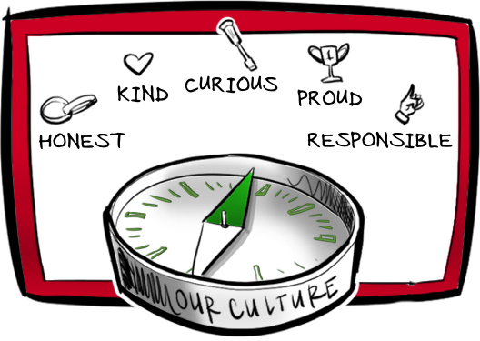

## When you work at Logiqs ...

 * You will apply your software talents to accelerate access to honest food.
 * You will work on challenging problems by building software that makes machines flow and food grow.
 * You will work with kind, honest, curious, responsible and proud people like yourself. People who care!

Together we can change the way we produce and consume food.

## Our mission

We accelerate access to honest food by delivering software that makes the world grow and flow.

<iframe width="560" height="315" src="https://www.youtube.com/embed/95hncbPMOrI" title="YouTube video player" frameborder="0" allow="accelerometer; autoplay; clipboard-write; encrypted-media; gyroscope; picture-in-picture" allowfullscreen></iframe>

## Who we are

We are a team of kind people that care about the world, our users and each other. We build software we can be proud of. We are curious to better understand what our users need. We are curious to uncover better ways of delivering software. We are honest in assessing where we currently stand. We are responsible to adapt our behavior accordingly.

 * [Meet the People](people.md)

## Want to join?

If you want to join us on our mission and our core values resonate with you, then please get in touch. 

 * [Apply Now](apply_now.md)
 * [How to Apply](apply.md)
 * [Our Recruitment Website](https://recruitment.logiqs.nl/)
 * [FAQ](faq.md)